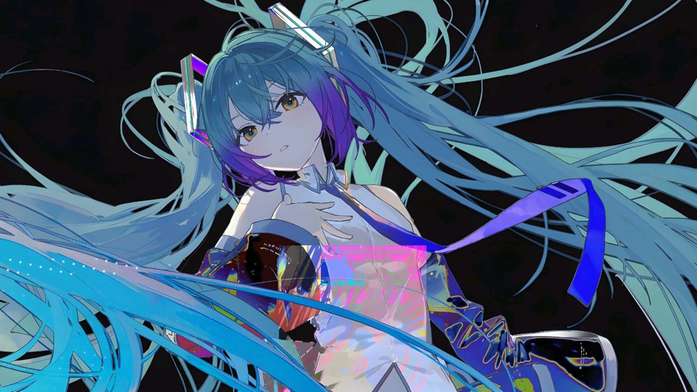

<table width="100%" border="0" cellspacing="0" cellpadding="0">
<tr>
<td width="60%" valign="top">
  
  <h3 style="font-family: monospace; color: #7F77DD; margin-bottom: 3px;">./whoami</h3>

  - Name: **Sarmad Ansari**.
  - From: **Karachi, Pakistan**.
  - Currently: studying [**Computer Science**](https://iba.edu.pk) at **IBA**.
  - Also: **Neovim** User, **GNU/Linux** Enthusiast.

  <h3>./Hobbies</h3>

  - Photography (olympus EPL-1)
  - Art (Traditional & Digital)
  - Anime/Manga
  - Classical Literature
</td>
<td width="40%" valign="top" align="right">
  
</td>
</tr>
</table>

 

<table width="100%">
<tr>
<td width="50%" valign="top">

 

- ‧₊˚♪ 𝄞₊˚⊹ [***SpaceSim - N-Body Gravitational Engine***](https://github.com/DerAnsari/SpaceSim)
- ‧₊˚♪ 𝄞₊˚⊹ [***DIY Digital Audio Player - Portable ESP32-S3***](https://github.com/DerAnsari/DAP)
- ‧₊˚♪ 𝄞₊˚⊹ [***SASH - Custom linux Shell written in C***](https://github.com/DerAnsari/hyprland-dots)
- ‧₊˚♪ 𝄞₊˚⊹ [***TPU Core - 16-Bit Systolic Array Architecture***](https://github.com/DerAnsari/TPU)
- ‧₊˚♪ 𝄞₊˚⊹ [***Hyprland-Dots - Tiling Window Manager Rice***](https://github.com/DerAnsari/hyprland-dots)
- ‧₊˚♪ 𝄞₊˚⊹ [***Bad Apple Display - Binary Data Stream***](https://github.com/DerAnsari/BadApple-ESP32)
</td>
<td width="50%" valign="top">

</td>
</tr>
</table>

 

   
   
   
  
   
  

  <i>"The struggle itself toward the heights is enough to fill a man's heart. One must imagine Sisyphus happy."</i>

