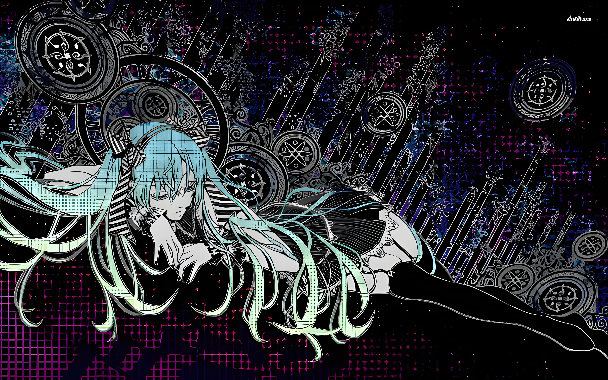

<!-- ═══════════════════ BANNER ═══════════════════ -->

<div align="center">

  [](https://git.io/typing-svg)

</div>

---

<!-- ═══════════════════ MAIN LAYOUT ═══════════════════ -->

<table>
<tr>
<td valign="top" width="58%">

```
$ whoami
DerAnsari · he/him · Karachi, PK
BSCS @ IBA Karachi · Linux/FOSS enthusiast
```

> *"The struggle itself toward the heights is enough to fill a man's heart"*

```
$ cat interests.txt
  [*] systems programming · computer graphics · embedded hw
  [*] anime/manga drawing  (day N of daily practice)
  [*] film photography · Olympus E-PL1
  [*] existentialism · classic literature
```

```
$ cat currently.txt
  [>] diy mp3 player — esp32-s3 + pcm5102a dac
  [>] hyprland rice (always)
  [>] BSCS @ IBA Karachi — summer semester
  [>] getting better at drawing every day
```


</td>
<td valign="top" width="42%" align="center">


<br><br>


</td>
</tr>
</table>

<!-- ═══════════════════ DIVIDER ═══════════════════ -->

<div align="center">
  
</div>

<!-- ═══════════════════ PROJECTS + STATS ═══════════════════ -->

<table>
<tr>
<td valign="top" width="50%">

```
$ ls ~/projects
```

| project | stack |
|---|---|
| [SpaceSim](https://github.com/DerAnsari/SpaceSim) | C++ · Barnes-Hut · OpenGL |
| [TPU](https://github.com/DerAnsari/TPU) | Logisim · custom ISA · 16-bit |
| [hyprland-dots](https://github.com/DerAnsari/hyprland-dots) | Hyprland · Lua · rice |
| Bad Apple OLED | ESP32-S3 · 1.3" OLED · SD stream |
| DIY MP3 Player | ESP32-S3 · PCM5102A · cassette |

</td>
<td valign="top" width="50%" align="center">

```
$ cat ~/.stats
```


</td>
</tr>
</table>

<!-- ═══════════════════ NOW PLAYING ═══════════════════ -->

<div align="center">

```
$ now-playing
```

<!-- setup: https://github.com/kittinan/spotify-github-profile -->
<!-- replace the src below with your widget URL after setup   -->


</div>

<!-- ═══════════════════ DIVIDER ═══════════════════ -->
<div align="center">
  
</div>
<div align="center">
  
</div>

<!-- ═══════════════════ FOOTER ═══════════════════ -->
<div align="center">
  <br>

  [](https://linkedin.com/in/sarmad-ansari-ab57862b9)
  [](https://sarmad-project.vercel.app)
  [](https://sophos.log)
</div>
